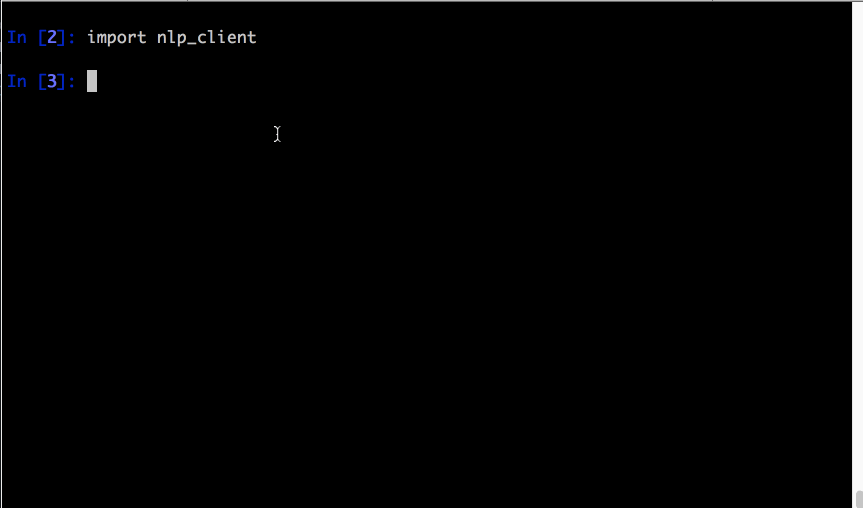

Stanford Core NLP REST Wrapper
=================================


###Stanford Core NLP Functionality
[Stanford Core NLP][1] provides tasks crucial for Natural Language Processing, such as:

1.  Tokenization
2.  Parse Tree generation from sentences
3.  Finding Coreferences
4.  Detecting Relations/Dependencies between words in sentences

###It's in Java & I Wish to Use Python
However, Stanford Core NLP is written in Java. And I wish to use the REPL that [IPython][2] provides.

###Rest Service
Therefore, this application wraps Stanford Core NLP in a simple Scala-based [Play Framework][3] RESTful web service.


#####Demo Client Web Application
Written in Python to highlight how to use


##Getting Started

Verify [Java 8 JDK][4] is installed


####Run Server

```bash

$ git clone https://github.com/JOfTheAncientGermanSpear/stanford-core-nlp-rest.git  
$ cd standford-core-nlp-rest/server  
$ ./activator run  

```

1. Type http://localhost:9000/api/[Some sentence] in your web browser's location bar.
  * Note: first run will take longest
1. JSON result will be returned


####Run Python Client
1. Open a new tab, with server running
```bash
$ cd stanford-core-nlp-rest/demo-client-webapp/
$ ipython
```



The "tree_generator" module can be used to convert the resultant JSON, to [NLTK Trees][5]


####Run Simple Web App
1. Open a new tab, with server running
```bash
$ cd stanford-core-nlp-rest/demo-client-webapp/
$ python web_app.py
```


[1]: http://nlp.stanford.edu/software/corenlp.shtml
[2]: www.ipython.org
[3]: https://www.playframework.com/
[4]: http://www.oracle.com/technetwork/java/javase/downloads/jdk8-downloads-2133151.html
[5]: http://www.nltk.org/book/ch07.html#trees
